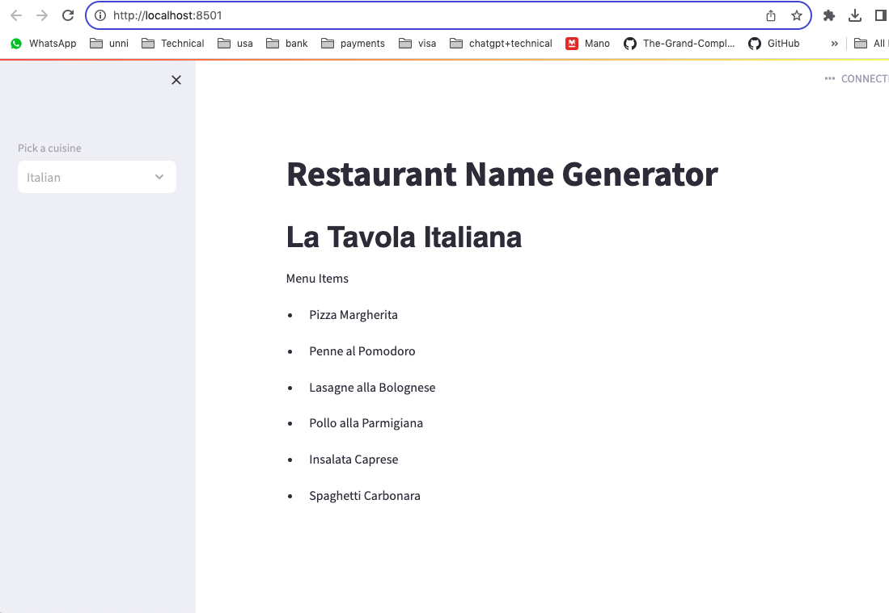

# RestaurantNameGenerator 

# LLM Based Name and Menu generator for Restaurant

'RestaurantNameGenerator' folder contain the streamlit app that generates 
restaurant name based on the cuisine and also the food items in that restaurant.

Using LangChain framemwork, llm and OpenAI API. 

1. Install necessary modules by running following command
	pip install -r requirements.txt

2. Generate your and ADD your openai key in ApiKey.py

3. Launch the application using the following command: streamlit run RestaurantName.py 

